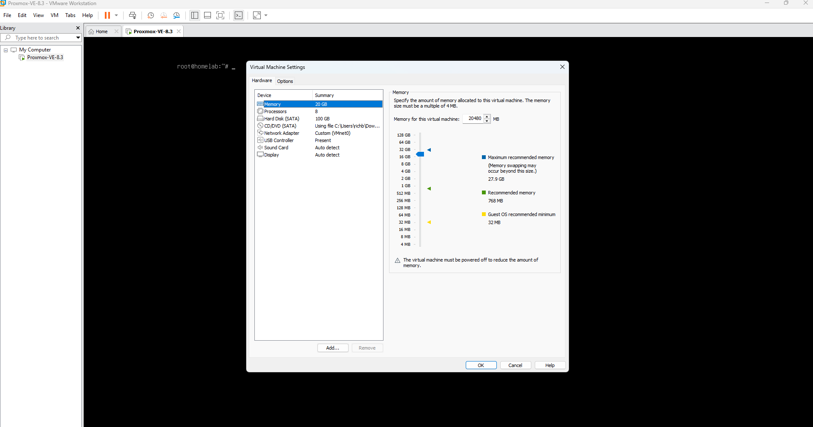
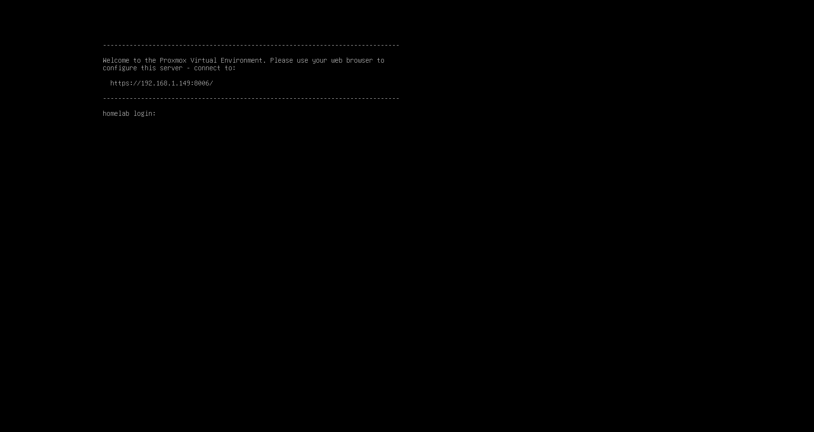
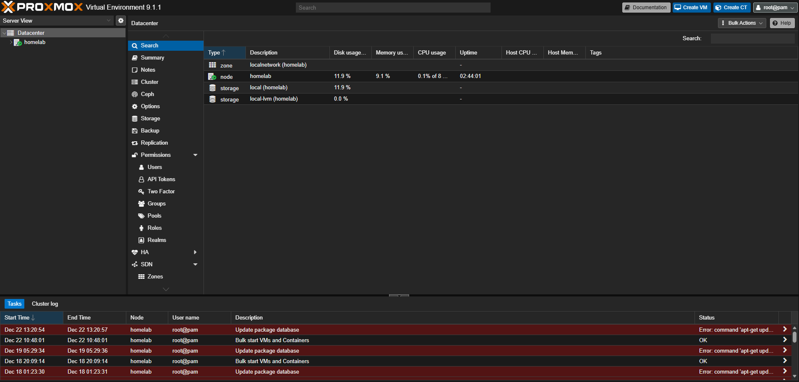
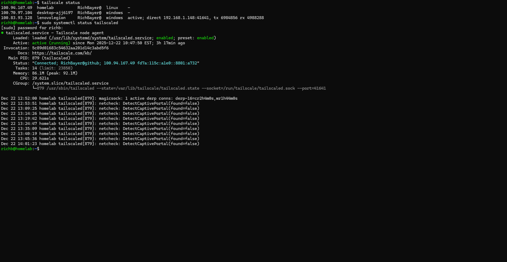
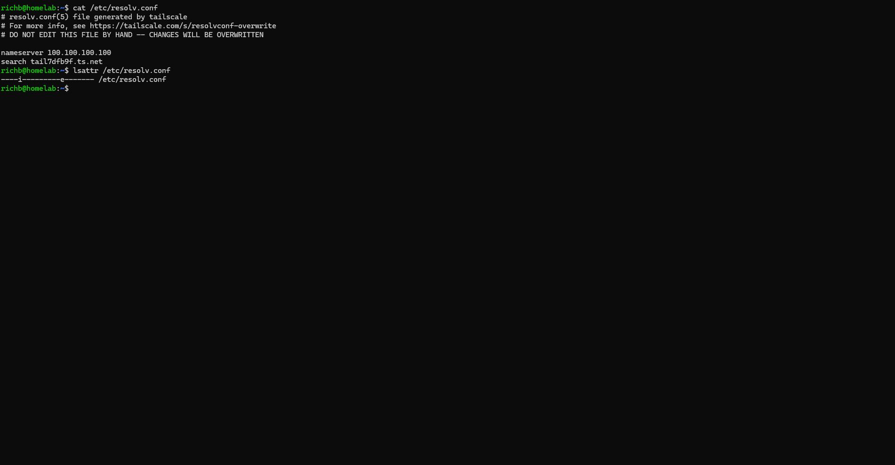
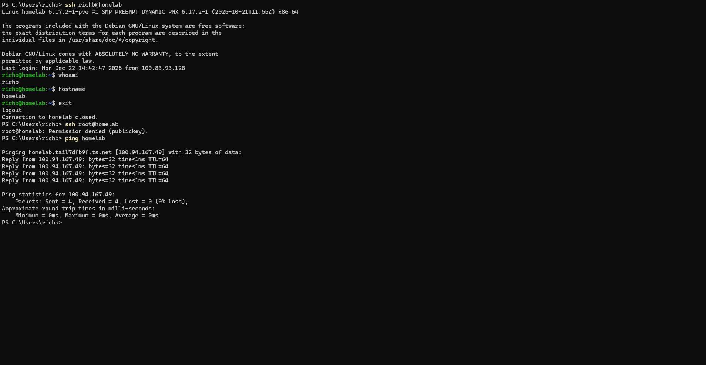

Project Goal: Build an enterprise-grade nested Proxmox homelab for CompTIA Linux+ practice, Ansible automation, and a standout GitHub portfolio demonstrating real-world sysadmin skills. Target completion of core lab: early 2026. Job deadline: May 2026.

Hardware (Lenovo Legion Desktop):
- CPU: AMD Ryzen 7 5800X (16 threads)
- RAM: 32 GB
- GPU: RTX 3060 12 GB
- Motherboard: Lenovo 3716 (B550 chipset)
- Storage (as of December 2025):
  - 256 GB NVMe (original): Windows 11 boot (default)
  - 1 TB 2.5" SATA SSD: Dedicated to lab storage (wiped clean Dec 12 2025)
  - 2 TB Samsung 990 PRO NVMe PCIe 4.0 (new, installed Dec 5 2025): Windows personal files and media only
  - 4 TB external USB HDD: Backups and ISOs only

Remote Access Devices:
- Lenovo Yoga laptop (daily driver, Tailscale installed)
- Galaxy S24 phone (Termius SSH client app installed for mobile access)

Phase 0: Hardware Upgrade to Free the 1 TB SATA SSD (December 5 2025)
Originally, the 1 TB 2.5" SATA SSD contained personal files and was not available for lab use.
To dedicate it fully to the homelab:
- Purchased and installed a new 2 TB Samsung 990 PRO NVMe SSD (PCIe 4.0 with heatsink) exclusively for Windows personal files and media.
- Installation process:
  - Shut down and unplugged Legion.
  - Removed side panel.
  - Removed stock AMD Wraith Prism CPU cooler (required to access the secondary M.2 slot below the RTX 3060).
  - Cleaned old thermal paste from CPU and cooler.
  - Applied new high-quality thermal paste.
  - Reinstalled cooler with proper torque sequence.
  - Located empty secondary M.2 slot on motherboard (below graphics card - no need to remove GPU).
  - Installed the new 2 TB NVMe drive into the slot and secured it.
  - Reassembled case.
- Booted into Windows, initialized and formatted the new drive as D: (NTFS).
- Moved all personal files from the 1 TB SATA SSD to the new 2 TB NVMe.
- Result: 1 TB SATA SSD now completely free and ready for exclusive lab use.

Phase 1: Bare-Metal Proxmox Attempts (Early December 2025 - Abandoned)
Initial plan was bare-metal Proxmox installation with dual-boot alongside Windows 11.
Multiple failed attempts:
- Tried installing Proxmox directly onto the 4 TB external USB HDD - networking failed (onboard NIC disabled when booting from USB).
- Several installs targeting the internal 1 TB SATA SSD - installer repeatedly selected wrong drive (risking Windows boot NVMe), black screens, shell access issues, partial Debian minimal installs that were later abandoned.
Critical flaws identified:
- Dual-booting required physical reboots to switch OS - unacceptable for family Windows use.
- No way to access lab remotely when booted into Windows.
- Ongoing GRUB/boot menu friction and risk of breaking Windows boot.
Decision (December 12 2025, ~11 PM): Completely abandon bare-metal approach. Wipe the 1 TB SATA SSD clean using wipefs, parted, and dd. Pivot to nested Proxmox VE 8.3 running as a VM under VMware Workstation Pro on the Windows 11 host.
Reasons for nested virtualization:
- Family retains uninterrupted Windows access (default boot).
- Full remote access via Tailscale from Yoga laptop even when Legion is in Windows.
- Ability to copy-paste, keep chat windows open, and multitask while building.
- Near-bare-metal performance (95-98%) thanks to nested AMD-V support on Ryzen 5800X.
- Eliminates all dual-boot headaches forever.

Phase 2: Nested Proxmox VM Creation and Initial Install (December 14 2025)
- Installed VMware Workstation 17 Pro (free personal use) on Windows 11 host.
- Created new VM for Proxmox:
  - Guest OS selection: Linux - Debian 12.x 64-bit
  - 20 GB RAM allocated
  - 8 vCPU
  - 100 GB thin-provisioned virtual disk for root
  - Added raw physical passthrough of the entire 1 TB SATA SSD (for maximum VM/LXC storage performance)
  - Bridged networking
  - Enabled nested virtualization (critical setting for Proxmox guests to run efficiently)
- Mounted latest Proxmox VE 8.3 ISO and performed fresh install inside the VM.
- During installer:
  - Set static IP 192.168.1.149/24, gateway 192.168.1.1
  - Completed installation and rebooted
- Post-install:
  - Proxmox web GUI accessible at https://192.168.1.149:8006 (self-signed certificate warning - normal)
  - Set up passwordless SSH as root from Windows host using existing ed25519 key pair:
    - Copied public key to /root/.ssh/authorized_keys
    - Set correct permissions (700 on .ssh, 600 on authorized_keys)
  - Confirmed passwordless root SSH working from Windows

Phase 3: Initial Issues and Troubleshooting (December 14 2025)
After fresh install, two major issues surfaced:
- DNS resolution completely broken inside the VM:
  - ping debian.org failed with "Temporary failure in name resolution"
  - apt update failed similarly
  - /etc/resolv.conf contained only nameserver 100.100.100.100 (Tailscale magic DNS)
- Tailscale daemon not running:
  - systemctl status tailscaled returned "unit not found"
Root cause:
- Earlier Tailscale installation used static binaries (manual download and execution).
- Static binaries do not create a systemd service unit - no auto-start on boot or after downtime.
- When tailscaled is down, magic DNS (100.100.100.100) cannot resolve anything - creates DNS failure loop.
Temporary workaround:
- Overwrote /etc/resolv.conf with public DNS servers:
  echo "nameserver 8.8.8.8" > /etc/resolv.conf
  echo "nameserver 1.1.1.1" >> /etc/resolv.conf
- Confirmed resolution working (ping debian.org succeeded, apt update pulled repositories)
Note: enterprise.proxmox.com repository errors (401 Unauthorized, not signed) appeared during apt update - expected and harmless on community/no-subscription install.

Phase 4: Security Hardening and Best Practices (December 14 2025)
CompTIA Linux+ emphasis: never perform daily work as root. Created proper non-root user workflow.
Actions:
- Created new user richb:
  adduser richb
- Added richb to sudo group:
  usermod -aG sudo richb
- Installed sudo package:
  apt install sudo
- This automatically created /etc/sudoers with standard %sudo ALL=(ALL:ALL) ALL entry.
- Logged in as richb@192.168.1.149 (password prompt)
- Verified sudo access:
  sudo whoami returned "root"
SSH hardening:
- Edited /etc/ssh/sshd_config:
  Changed PermitRootLogin yes to PermitRootLogin no
- Restarted SSH service:
  sudo systemctl restart ssh
- Behavior note: existing SSH sessions remained connected - new connections immediately enforce updated config.
- Confirmed direct root login blocked in new terminal attempts.
Protection against Proxmox overwriting Tailscale DNS:
- Made /etc/resolv.conf immutable:
  sudo chattr +i /etc/resolv.conf
- Tailscale can still manage it internally; Proxmox cannot overwrite.
Pending task:
- Copy ed25519 public key to /home/richb/.ssh/authorized_keys for fully passwordless richb login (completed Dec 15 from Yoga).
- Optional future: disable PasswordAuthentication entirely in sshd_config.

Phase 5: Permanent Tailscale Implementation (December 14-15 2025 - Milestone 1 Complete)
Switched from static binaries to official Debian package for proper service management.
Steps:
- Added Tailscale repository and keyring (for package signature verification):
  curl -fsSL https://pkgs.tailscale.com/stable/debian/trixie.noarmor.gpg | sudo tee /usr/share/keyrings/tailscale-archive-keyring.gpg >/dev/null
  curl -fsSL https://pkgs.tailscale.com/stable/debian/trixie.tailscale-keyring.list | sudo tee /etc/apt/sources.list.d/tailscale.list
- Updated repositories and installed package:
  sudo apt update
  sudo apt install tailscale
- Package automatically created and enabled systemd service tailscaled.service.
- Brought service online:
  sudo tailscale up
- No authentication URL needed - reused existing machine key from previous static install.
Verification:
- tailscale status showed homelab online at 100.94.167.49
- systemctl status tailscaled showed active (running) and enabled
- /etc/resolv.conf now managed by Tailscale (nameserver 100.100.100.100, search domain added)
- Magic DNS functional (ping homelab resolved correctly)
Remote Access Summary:
- Full 24/7 access confirmed via Tailscale from:
  - Windows host (local + remote)
  - Lenovo Yoga laptop (web GUI and SSH)
  - Galaxy S24 phone via Termius SSH client app (quick mobile access from anywhere)

Current Status (December 15 2025)
- Nested Proxmox VE 8.3 host fully operational under VMware Workstation on Windows 11.
- All Milestone 1 objectives achieved:
  - Proxmox updated and stable
  - Tailscale installed properly with auto-start and magic DNS
  - Passwordless key-based SSH (root complete, richb finalized today from Yoga)
  - Best-practice user workflow: richb + sudo for all work
  - Direct root SSH login disabled
  - Windows power/sleep set to Never

Phase 6: Final Hardening and Milestone 1 Completion (December 22, 2025)

Over the past week I focused on polishing Milestone 1 and pushing the security and usability as far as practical for a homelab.

What got done:
- Confirmed rock-solid 24/7 remote access via Tailscale from the Yoga laptop (connects automatically) and even quick mobile checks with Termius on the phone
- Finished full enterprise-grade SSH hardening:
  - Passwordless key-based login as the non-root richb user (with full copy-paste working in terminals)
  - Direct root SSH completely blocked (PermitRootLogin no)
  - Disabled password authentication entirely (PasswordAuthentication no, ChallengeResponseAuthentication no, KbdInteractiveAuthentication no) — now true key-only access only
  - Added extra protection by making /etc/resolv.conf immutable with chattr +i (defense-in-depth against any accidental overwrites)
- Cleaned up the Proxmox web dashboard: disabled the enterprise and ceph-enterprise repositories so the repeating task errors and subscription warnings are gone (using the standard no-subscription repo — normal for homelabs)
- Took a complete set of screenshots to prove everything works end-to-end

These steps bring the setup to real production-level security while keeping it easy to work with every day. A lot of this directly ties into CompTIA Linux+ material around secure SSH configuration, user management, and network troubleshooting.

Proof screenshots (stored in screenshots/milestone-1/):

- VMware Workstation Pro VM settings (nested virtualization, resource allocation, 1 TB SATA raw passthrough):  
  

- Proxmox welcome console inside VMware:  
  

- Clean Proxmox web dashboard after repo fixes:  
  

- Combined Tailscale status and service health:  
  

- resolv.conf showing Tailscale MagicDNS and the immutable flag:  
  

- Full secure remote access workflow (passwordless richb login, root rejected instantly with no prompts, MagicDNS ping):  
  
  
With all this in place, Milestone 1 is officially complete — stable nested Proxmox host, true 24/7 remote access, hardened security, and full documentation with proof.

On to Milestone 2: Rocky Linux 9 cloud-init template.
This log will continue to be updated as each milestone is completed.
